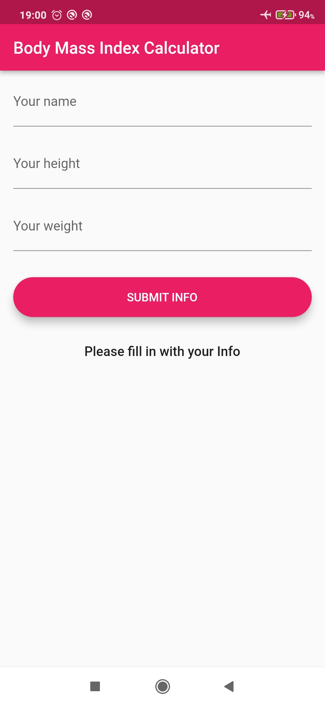
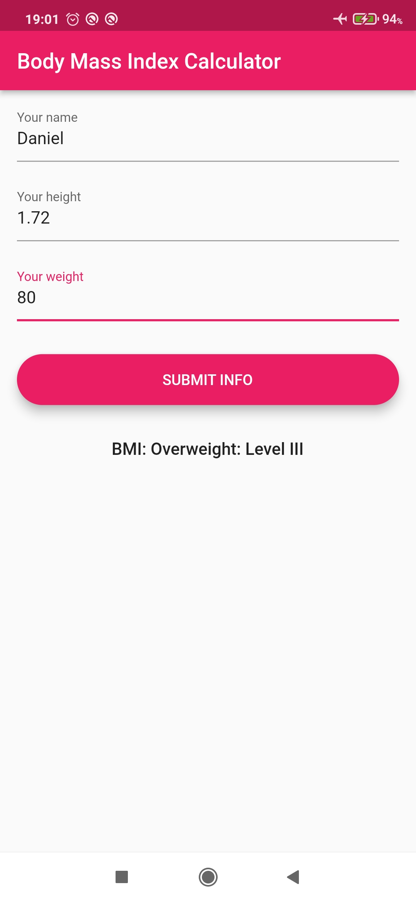

# Body Mass Index Calculator

===================================

This project is one of my solutions for the "Flutter Specialist Bootcamp", provided
by [Digital Innovation One](https://www.dio.me) - An Information Technology teaching platform.

App Overview
-------------

The project uses an individual's personal info to calculate his Body Mass Index. The app implements User inputs, Unit Tests and Exception Handling.

Technologies used:
---------------

- Flutter 
- [Test](https://pub.dev/packages/test)

Screenshots:
------------
 
 

-------------

License
-------

Licensed to the Apache Software Foundation (ASF) under one or more contributor
license agreements.  See the NOTICE file distributed with this work for
additional information regarding copyright ownership.  The ASF licenses this
file to you under the Apache License, Version 2.0 (the "License"); you may not
use this file except in compliance with the License.  You may obtain a copy of
the License at

http://www.apache.org/licenses/LICENSE-2.0

Unless required by applicable law or agreed to in writing, software
distributed under the License is distributed on an "AS IS" BASIS, WITHOUT
WARRANTIES OR CONDITIONS OF ANY KIND, either express or implied.  See the
License for the specific language governing permissions and limitations under
the License.

